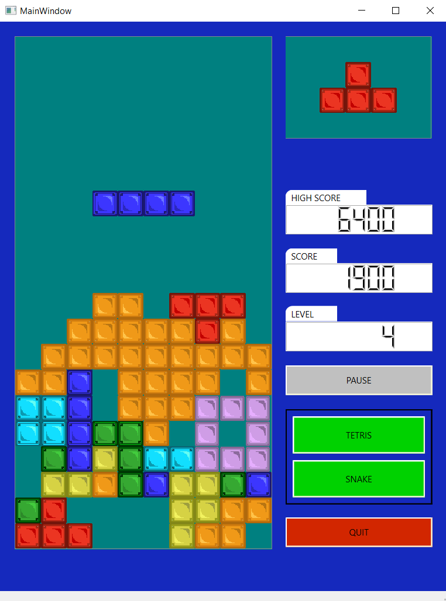
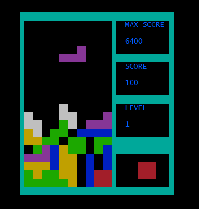
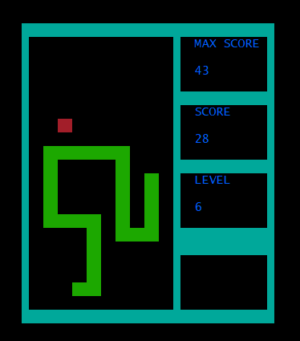

# Игровая консоль

Эмулятор консоли, позволяющий использовать единственный бэк для запуска змейки и тетриса как в терминале с использованием ncurses, так и через графический интерфейс на qt. Поддерживается система уровней (на каждом новом уровне повышается скорость). Реализована возможность ставить игру на паузу и сохранять рекорд игрока между запусками приложения.
  
